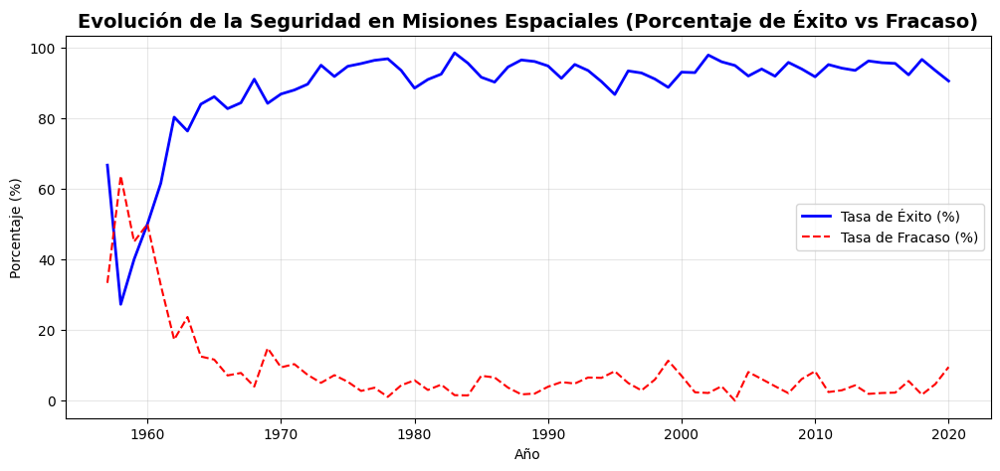

# Proyecto 2: Análisis Exploratorio de Datos (EDA) - Misiones Espaciales Históricas

Este proyecto forma parte de mi portafolio profesional de Análisis de Datos. En esta práctica, el enfoque se desplaza del data wrangling hacia el **Análisis Exploratorio de Datos (EDA)** y la obtención de respuestas de negocio mediante la manipulación estadística e histórica de variables temporales, financieras y de estado.

## 📌 Objetivos del Análisis
Responder a preguntas clave sobre la evolución de la carrera espacial desde 1957 hasta la actualidad, identificando organizaciones dominantes, tendencias de costos, estacionalidad y tasas de éxito en la ingeniería aeroespacial.

## 🛠️ Tecnologías Utilizadas
* **Python 3.x**
* **Pandas & NumPy** (Indexación, agrupaciones complejas y tablas cruzadas)
* **Matplotlib & Seaborn** (Visualización estadística de tendencias)

## 📊 Hallazgos y Respuestas Clave

### 1. Líderes Históricos por Año
El volumen de lanzamientos refleja perfectamente la geopolítica mundial. Se identificó un pico masivo de lanzamientos durante la Guerra Fría (1965-1977) dominado casi en su totalidad por la **RVSN USSR**. Tras un periodo de estancamiento, el siglo XXI muestra un nuevo auge liderado por la agencia estatal china (**CASC**) y la disrupción comercial de **SpaceX**.

### 2. Evolución del Costo en el Tiempo
El análisis financiero demostró que los costos históricos están altamente sesgados debido al secreto gubernamental (alto índice de nulos en las primeras décadas). Las misiones con datos de precio transparente corresponden a la era moderna de transbordadores y contratos comerciales masivos. 

### 3. Estacionalidad (Meses más populares)
Se observa una preferencia ligera por meses como **Diciembre y Junio**. En analítica aeroespacial, esto no responde a estaciones meteorológicas tradicionales, sino a la apertura de "ventanas de lanzamiento orbitales" específicas y cierres de asignaciones presupuestarias anuales.

### 4. Análisis de Seguridad (Éxitos vs. Fracasos)
A través de un análisis temporal con tablas cruzadas indexadas, se comprobó que **las misiones espaciales se han vuelto radicalmente más seguras**. Las tasas de fracaso del 40% registradas en los años 50 y 60 dieron paso a una industria madura que mantiene niveles de éxito consistentemente superiores al **92%** en la era moderna.

 *(Reemplaza por el nombre de tu gráfico descargado)*

## 📁 Archivos en esta sección
* `Análisis_de_Misiones_Espaciales.ipynb`: Código fuente con las agrupaciones (`groupby`), tabulaciones cruzadas (`crosstab`) y visualizaciones.
