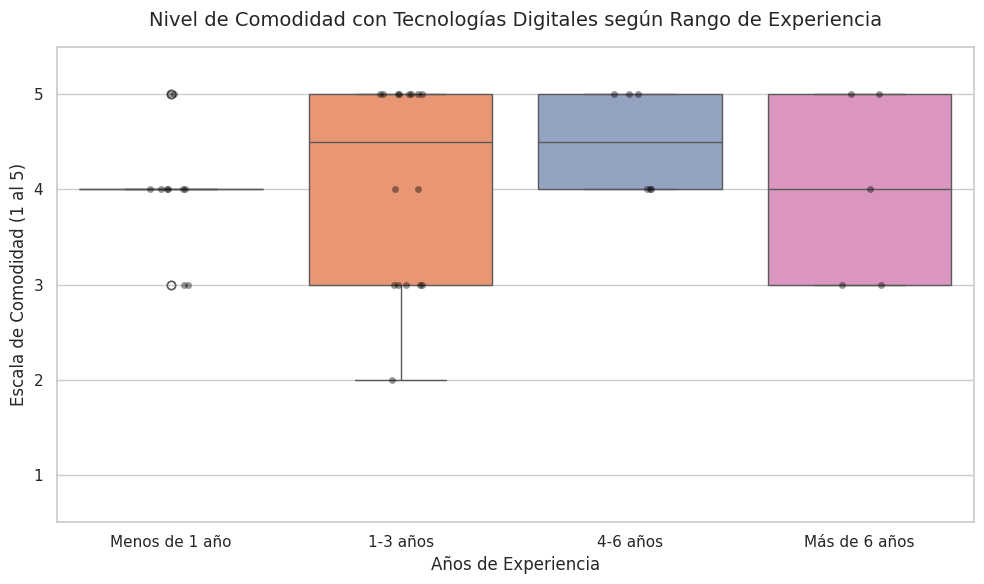
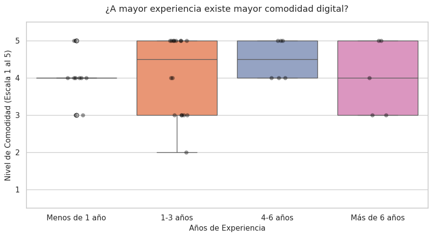
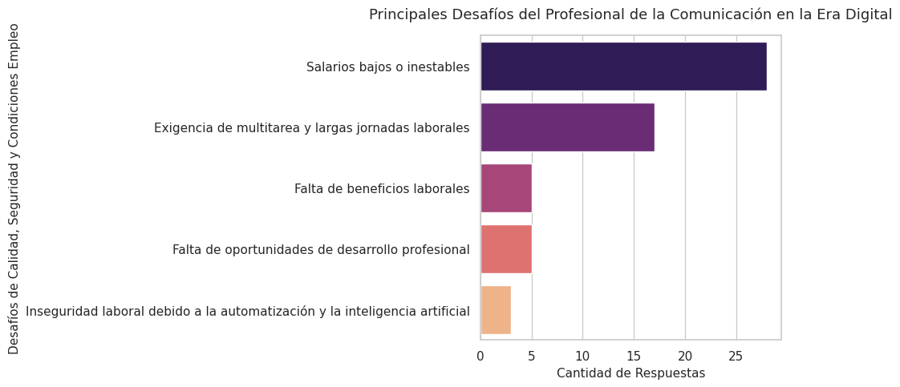

# 📊 Proyecto 3 - Análisis de Datos: Desafíos del Profesional de la Comunicación en la Era Digital (Tesis 2024)

Este proyecto forma parte de mi portafolio profesional de Análisis de Datos. Consiste en el análisis exploratorio (EDA) y las visualizaciones de datos derivadas de la encuesta estructurada que diseñé y ejecuté para mi **Trabajo de Tesis de Grado en Comunicación Social (2024)**. 

El estudio tuvo como objetivo principal identificar la situación laboral, los niveles de madurez digital y las principales problemáticas que enfrentan los comunicadores en un entorno fuertemente competitivo y automatizado. Demuestra un flujo completo de análisis: desde la recolección de respuestas de profesionales activos de la muestra, limpieza de datos con Python, hasta el *Data Storytelling* crítico de fenómenos socioeconómicos del sector.

## 🛠️ Tecnologías y Herramientas Utilizadas
* **Lenguaje:** Python 3.x
* **Librerías de Análisis:** Pandas, NumPy
* **Librerías de Visualización:** Matplotlib, Seaborn
* **Muestra:** 37 respuestas recolectadas de profesionales en activo (Agencias, Medios y Corporativos).

---

## 🎯 Principales Hallazgos y Visualizaciones

### 1. Perfil Demográfico y Distribución de Roles
La muestra exhibe una fuerte concentración de profesionales en etapas tempranas de su carrera, predominantemente insertos en agencias de marketing y medios tradicionales de comunicación.
* **Años de Experiencia:** La mayoría de los encuestados se encuentra en el rango de 1-3 años de experiencia laboral.
 *(Nota: Si dejas las imágenes sueltas en la carpeta remueve el "/images")*

* **Roles y Estructuras:** Los roles de *Gestor de Redes Sociales* y *Especialista en Marketing Digital* dominan el terreno de las agencias privadas, mientras que los perfiles tradicionales de *Periodista* se mantienen concentrados casi en exclusiva en medios de comunicación.

### 2. Madurez Digital y Adopción Tecnológica
A pesar de las disrupciones tecnológicas, los profesionales demuestran un nivel sobresaliente de resiliencia y adaptabilidad al ecosistema digital.
* **Nivel de Comodidad General:** Un porcentaje abrumador de los encuestados se sitúa en los niveles más altos de comodidad frente a las herramientas tecnológicas (puntuaciones de 4 y 5 sobre 5).

### 3. La Paradoja de la Experiencia vs. Comodidad Digital
Uno de los análisis más interesantes de la investigación fue evaluar si los años de experiencia modificaban la confianza en el uso de tecnologías digitales.
* **Análisis Boxplot:** A través de la distribución de los cuartiles, observamos que la mediana del nivel de comodidad se mantiene notablemente alta (en torno a los 4 y 5 puntos) de manera transversal en todos los rangos (desde <1 año hasta >6 años de trayectoria). La tecnología ya no es un factor exclusivo de los recién graduados, sino una competencia obligatoria y homogeneizada en el sector.

### 4. La Paradoja Socioeconómica: El Perfil "Orquesta"
A pesar de contar con profesionales altamente calificados, cómodos con la tecnología y con habilidades multifuncionales, el mercado laboral presenta serias deficiencias estructurales.
* **Principales Desafíos:** Los *Salarios bajos o inestables* y la *Exigencia de multitarea junto a largas jornadas laborales* son los dolores más grandes del sector.

> **Conclusión del Hallazgo:** Existe una brecha crítica; el mercado exige perfiles multidisciplinarios "orquesta" (que diseñen, redacten, analicen métricas de marketing y editen), pero la retribución económica y los beneficios laborales no están corriendo a la par de esas exigencias técnicas.

---

## 📈 Conclusión de Portafolio
Este proyecto no solo permitió validar estadísticamente las hipótesis planteadas en mi tesis de grado, sino que demuestra de forma práctica cómo el análisis de datos cuantitativos puede transformar opiniones y percepciones sectoriales en métricas visuales claras, accionables y con alto valor crítico para el entendimiento de mercados laborales o estrategias de **Marketing Analytics**.

## 📁 Estructura de Archivos
* `Analisis_Encuesta_Tesis_2024.ipynb`: Notebook con el código comentado de la carga de la encuesta, limpieza de strings y generación de gráficos estadísticos.
