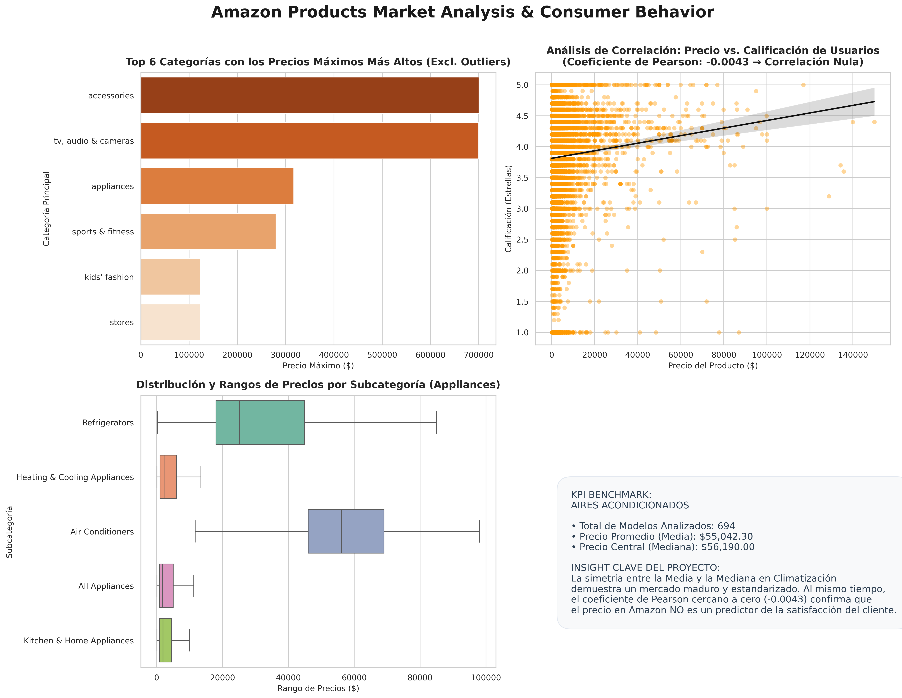

# 📊 Amazon Products Market Analysis & Consumer Behavior

## 📑 Descripción del Proyecto
Este proyecto de portafolio realiza un análisis masivo de datos (**+466,000 registros válidos**) sobre productos listados en Amazon. El objetivo principal es evaluar las dinámicas de fijación de precios (*Pricing Strategies*) y validar de forma estadística si el costo de un producto actúa como un predictor de la satisfacción del cliente a través de sus calificaciones.

El pipeline completo de datos fue desarrollado en **Python (Google Colab)**, abarcando desde la ingesta de 104 archivos CSV independientes, limpieza avanzada de strings (Data Wrangling), detección y aislamiento de anomalías (*Outliers*), hasta la generación de analíticas avanzadas con **Matplotlib y Seaborn**.

---

## 🎯 Preguntas de Negocio y Visualización Definitiva

A través del procesamiento y modelado estadístico, se dio respuesta a las 4 preguntas guía del negocio:



### 📉 1. ¿Cuál es el precio promedio en Aires Acondicionados?
* **Métricas Clave:** * **Precio Promedio (Media):** $55,042.30
  * **Precio Central (Mediana):** $56,190.00
  * **Modelos Analizados:** 694
* **Insight de Negocio:** La mínima diferencia entre la media y la mediana refleja una **distribución altamente simétrica** dentro del mercado de climatización. Esto demuestra que es un sector maduro, con precios altamente estandarizados y sin presencia de outliers extremos distorsionando el promedio.

### 🏆 2. ¿Qué categorías contienen los productos con precios más altos?
* **Hallazgo Estadístico:** Tras aplicar filtros de calidad de datos, el top de categorías con los precios máximos más elevados de la plataforma está liderado por **`accessories`** (~$700,300) y **`tv, audio & cameras`** (~$609,495).
* **Data Quality Note:** Durante el proceso exploratorio se detectó una anomalía severa (*Data Quality Anomaly*) en la categoría `home & kitchen` con un registro erróneo de 9.9 mil millones. Se implementó un aislamiento de outliers (`price_clean < 1,000,000`) para normalizar las escalas visuales del negocio.

### 🎯 3. ¿Existe una correlación entre precio y calificación en los productos?
* **Métrica Matemática:** Coeficiente de Correlación de Pearson: **`-0.0043`**
* **Insight de Marketing Analytics:** El coeficiente cercano a cero demuestra de forma científica una **correlación nula**. La nube difusa en el gráfico de dispersión y su línea de regresión completamente plana prueban que **el precio de un artículo en Amazon no influye en la satisfacción del cliente**. Las expectativas de valor se evalúan de manera relativa al costo pagado, no al valor absoluto del ticket.

### 📦 4. ¿Cuál es el rango de precio dependiendo del tipo de subcategoría?
* **Análisis de Dispersión:** Utilizando diagramas de cajas (*Boxplots*), se aislaron los rangos comerciales del sector `appliances`. 
* **Insight de Negocio:** El mercado se divide claramente en **Bienes de Alto Ticket** (`Air Conditioners` y `Refrigerators`), con barreras de entrada altas y medianas superiores a los $25k, frente a **Bienes de Consumo Masivo** (`Kitchen & Home Appliances`), con precios mínimos desde los $59 y una concentración en tickets bajos de alta rotación.

---

## 🛠️ Tecnologías y Herramientas Utilizadas
* **Python 3** (Entorno de ejecución masivo)
* **Pandas**: Concatenación vertical de múltiples fuentes, casteo de tipos de datos (`astype`), manipulación de strings y expresiones regulares para limpieza de monedas.
* **Matplotlib & Seaborn**: Diseño de reportes de cuatro cuadrantes con estilos ejecutivos de alta resolución (300 DPI), incluyendo diagramas de dispersión con líneas de regresión (`regplot`) y diagramas de caja (`boxplot`).

---

## 📈 Cómo Ejecutar el Proyecto
1. Cloná este repositorio:
   ```bash
   git clone [https://github.com/TU_USUARIO/amazon-market-analysis.git](https://github.com/TU_USUARIO/amazon-market-analysis.git)
